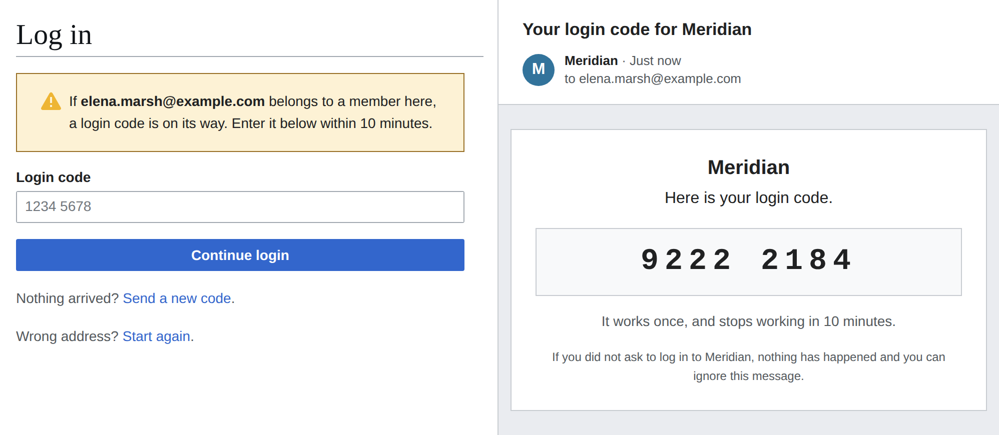

# Member Access

[](https://github.com/ProfessionalWiki/MemberAccess/actions?query=workflow%3ACI)
[](https://codecov.io/gh/ProfessionalWiki/MemberAccess)
[](https://packagist.org/packages/professional-wiki/member-access)
[](https://packagist.org/packages/professional-wiki/member-access)
[](LICENSE)

[MediaWiki] extension for members-only wikis: readers log in with an email one-time code, admitted by an
allowlist of addresses and domains organized into named groups. Members can read and nothing else, their
accounts are created at first login, and single sign-on logins can be held to the same allowlist. Groups,
allowlist entries and the member roster are managed over a REST API.

The extension decides who can log in, not who can read. Restricting reading to logged-in users is a
[wiki setting](https://professional.wiki/en/extension/member-access#Making-the-wiki-private).

[](https://professional.wiki/en/extension/member-access)

- [Introduction to the extension](https://professional.wiki/en/extension/member-access#Overview)
- [Usage documentation](https://professional.wiki/en/extension/member-access#Usage)
- [Installation](#installation)
- [Configuration](#configuration)
- [What loading the extension changes on the wiki](#what-loading-the-extension-changes-on-the-wiki)
- [Management API](#management-api)
- [Development](#development)
- [Release notes](#release-notes)

Get professional support for this extension via [Professional Wiki], its creators and maintainers.
We provide [MediaWiki Development], [MediaWiki Hosting], and [MediaWiki Consulting] services.

## Installation

Platform requirements:

* [PHP] 8.3 or later
* [MediaWiki] 1.43 or later
* MySQL, MariaDB or SQLite. No PostgreSQL schema is shipped
* Working outgoing email while the code login is on, since login codes and invitations are sent by mail
* [OpenIDConnect] 8.3 or later while single sign-on is held to the allowlist, configured with
  * `$wgOpenIDConnect_UseRandomUsernames` off and no preferred username processor set per provider, so
    that the extension names the member accounts;
  * `$wgOpenIDConnect_MigrateUsersByUserName` off, since it hands a login the account named by the
    login's `preferred_username`, which could be a member's account;
  * `$wgOpenIDConnect_MigrateUsersByEmail` on, so that a single sign-on login reaches the account the
    code login created for the same address rather than getting a second one

Clone into the wiki's `extensions/` directory:

```shell
git clone git@github.com:ProfessionalWiki/MemberAccess.git
```

Then add to `LocalSettings.php`:

```php
wfLoadExtension( 'MemberAccess' );
$wgMemberAccessCodeLogin = 'allowlisted';
```

Loading alone admits nobody. The second line turns on the code login for the addresses on the allowlist;
see [Login routes](#login-routes).

To send login codes and invitations as formatted mail rather than plain text, also set
`$wgAllowHTMLEmail = true;`.

Run `php maintenance/run.php update --quick` to create the extension's tables, and again after every
upgrade. The same run gives an opaque name to every member the extension did not name, which earlier
versions left under their email address or under the name their identity provider returned. The renames
are recorded in the rename log and, by user id, on the `MemberAccess` log channel. It does not move a
`User:` or `User talk:` page titled after an old name, so a wiki that has any moves them by hand, without
leaving a redirect. Core logs both names at debug level, so run it without `$wgDebugLogFile` pointing at
a file you keep.

## Configuration

| Variable | Type | Default | Description |
|---|---|---|---|
| `$wgMemberAccessCodeLogin` | string | `'off'` | Whom the code login admits: `allowlisted`, `open` or `off`. See [Login routes](#login-routes) |
| `$wgMemberAccessApplyAllowlistToSso` | bool | `false` | Whether single sign-on logins are held to the allowlist. See [Login routes](#login-routes) |
| `$wgMemberAccessReaderGroup` | string | `'reader'` | Name of the user group that members are placed in |
| `$wgMemberAccessCodeTtlSeconds` | int | `600` | How long an issued login code stays valid, in seconds |
| `$wgMemberAccessCodeAttemptLimit` | int | `5` | How many times a code may be entered before it is burned |
| `$wgMemberAccessEmailBurstLimit` | int | `3` | Maximum code requests per email address within 15 minutes |
| `$wgMemberAccessEmailDailyLimit` | int | `10` | Maximum code requests per email address within 24 hours |
| `$wgMemberAccessIpBurstLimit` | int | `10` | Maximum code requests per client IP within 15 minutes |
| `$wgMemberAccessIpDailyLimit` | int | `50` | Maximum code requests per client IP within 24 hours |
| `$wgMemberAccessSenderAddress` | ?string | `null` | Address that login codes and invitations are sent from. Falls back to `$wgPasswordSender` |
| `$wgMemberAccessSessionDurationSeconds` | int | `2592000` | How long a remembered login lasts, wiki-wide. Thirty days, against core's 180 days. `0` leaves `$wgExtendedLoginCookieExpiration` alone |

Issued codes and rate-limit counters are held in the main object stash (`$wgMainStash`), which is
database-backed by default. Point it at Redis or Valkey to keep them out of the database.

Route the log channel to keep the audit trail:

```php
$wgDebugLogGroups['MemberAccess'] = '/path/to/memberaccess.log';
```

### Login routes

Two settings, one per login route, say what the allowlist governs there and whether the code login is
offered at all. Neither route is offered until a setting says so.

`$wgMemberAccessCodeLogin` says whom the code login admits:

| Value | Who can log in with a code |
|---|---|
| `allowlisted` | The addresses an allowlist entry matches |
| `open` | Every address. A matching entry still attributes the member to its group; without one they have no group until an entry matches at a later login. The group a member has is never moved |
| `off` | Nobody. The code login is not offered. The default |

An unrecognized value is read as `off`, with a warning in the log. So is an empty one, without a warning.

`$wgMemberAccessApplyAllowlistToSso = true` holds single sign-on logins to the allowlist, as the
[usage documentation](https://professional.wiki/en/extension/member-access#Single-sign-on) describes.
For an account that is already a member, the address checked is the one on the roster. An account in
the reader group that is not on the roster is refused rather than exempted. By default single sign-on
is left alone: the accounts it creates are ordinary accounts, which stay exempt if the setting is turned
on later.

This works with [OpenIDConnect] and no other [PluggableAuth] plugin: the extension names a member's
account through OpenIDConnect's preferred username processor, and a plugin that names the account itself
gets its admitted logins refused, with an entry on the log channel. The OpenIDConnect settings this
depends on are listed under [Installation](#installation).

Narrowing a route ends the access of everyone it no longer admits, at their next login.

## What loading the extension changes on the wiki

Whatever the login routes are set to, loading the extension:

* revokes from the reader group everything that would let a reader change the wiki or see behind the
  scenes: editing, commenting, moving, uploading, deleting, protecting, tagging, creating accounts,
  sending email, reading the abuse filters and their log, and reading or changing their own private
  information or preferences, which closes `Special:ChangeEmail` to them;
* sets `$wgBlockDisablesLogin`, so blocking a member keeps them out of a private wiki;
* restricts the `renameuser` log to the `memberaccess-manage` right, unless the wiki already
  restricted it, since an entry there names what an account was called before, which for a member
  can be their email address;
* reserves the username `MemberAccess`, which the update that renames members records its renames as,
  so that no real account can be there for it to take over;
* refuses members a password: setting one and having a temporary one mailed are both refused.

While the code login is on, it also turns off ConfirmEdit's `badloginperuser` captcha trigger, so failed
logins no longer escalate to a captcha for the account they name, for everyone on the wiki and not only
for members. The per-IP `badlogin` trigger is left alone.

While the allowlist governs single sign-on, it also sets `$wgOpenIDConnect_PreferredUsernameProcessor`,
so that the member accounts that route creates are named after nobody, and
`$wgOpenIDConnect_EmailProcessor`, so that the address the plugin resolved is the one the allowlist is
asked about. Processors the wiki configured itself are kept and run first.

While either route can log a member in, it also:

* grants `autocreateaccount` to anonymous visitors, since a member's account is created by logging in;
* sets `$wgExtendedLoginCookieExpiration` to `$wgMemberAccessSessionDurationSeconds`, which decides
  how long a remembered login lasts for everyone on the wiki, not only for members.

## Management API

Groups, allowlist entries and the roster are managed over REST, under `/rest.php/member-access/v0/`.
Every endpoint requires the `memberaccess-manage` right, which sysops and bureaucrats have. Writes also
require the wiki's CSRF token in an `X-CSRF-TOKEN` header, unless the session provider is inherently
CSRF-safe.

| Endpoint | What it does |
|---|---|
| `GET /groups` | Every group with its entry count and its total and active member counts |
| `POST /groups` | Creates a group. Body: `name` |
| `PUT /groups/{id}` | Renames a group. Body: `name` |
| `DELETE /groups/{id}` | Deletes a group. Refused while it still holds entries, or while members are attributed to it |
| `GET /groups/{id}/entries` | The group's allowlist entries |
| `POST /groups/{id}/entries` | Adds entries, at most 500 per request. Body: `values`, a list of email addresses and `@domain`s |
| `DELETE /entries/{id}` | Removes an allowlist entry |
| `POST /entries/{id}/invitation` | Mails an invitation to the entry's address and records the time as the entry's `invited`. Refused for a domain rule, or while the code login is off |
| `GET /members` | The roster: each member's address, group, creation, last login and active flag, plus the totals overall and per group |
| `POST /members/{userId}/deactivate` | Ends a member's access. Also requires the `block` right, and refuses your own account |
| `POST /members/{userId}/reactivate` | Restores a member's access. Also requires the `block` right. The response's `blocked` says whether a block placed for another reason is still on the account |
| `DELETE /members/{userId}` | Removes a member, freeing their address for a new account. Refuses your own account |

A block placed for another reason is neither replaced by deactivating nor lifted by reactivating, and
deactivating is refused while such a block would not keep the member out by itself, because it runs out
or is only partial. Removing a member ends their open sessions and leaves their allowlist entry in place.
A deactivation block stays on the closed account rather than reaching the new one, and a removed member's
single sign-on logins arrive at the closed account and are refused.

Adding entries answers `200` with one result per value, in the order the values were given, each
echoing its value as sent and saying in `added` whether it was added. A refused value neither stops
the values after it nor undoes the ones before it, and says why in `errorCode` and `error`:
`invalid_entry_value`, `entry_value_too_long`, or `duplicate_entry`, which also names the group that
already admits the value.

```json
{
	"results": [
		{
			"value": "jane@example.com",
			"added": true,
			"entry": { "id": 7, "value": "jane@example.com", "kind": "email", "created": "2026-05-04T09:12:33Z", "invited": null }
		},
		{
			"value": "john@example.net",
			"added": false,
			"errorCode": "duplicate_entry",
			"error": "A group already admits that address or domain",
			"conflictingGroupId": 2,
			"conflictingGroupName": "Umbrella"
		}
	]
}
```

What concerns the request as a whole answers as a failed request instead, and adds nothing: no such
group (`group_not_found`), a body without a `values` list or with a value that is not text
(`invalid_request_body`), and more values than one request may carry (`too_many_entry_values`).

A failed request answers with the HTTP status and a body carrying a stable `errorCode` next to a
human-readable `error`: `not_logged_in`, `permission_denied`, `invalid_csrf_token`,
`invalid_request_body`, `invalid_group_name`, `group_name_too_long`, `duplicate_group_name`,
`group_not_found`, `group_not_empty`, `group_has_members`, `too_many_entry_values`,
`entry_not_found`, `not_an_address`, `code_login_off`, `invitation_not_sent`, `not_a_member`,
`cannot_deactivate_self`, `block_right_required`, `block_failed`, `unblock_failed`,
`cannot_remove_self`. A request the REST framework refuses first, such as one with an id that is not a
number or a body it cannot read, carries MediaWiki's error shape rather than this one.

## Development

Install dependencies from the extension directory:

```shell
composer install
```

Run all checks (PHPCS, PHPStan and PHPUnit) from a MediaWiki installation:

```shell
composer preflight
```

After changing a table definition in `sql/*.json`, regenerate the SQL for both database types:

```shell
php maintenance/run.php generateSchemaSql --json extensions/MemberAccess/sql/<table>.json \
	--sql extensions/MemberAccess/sql/mysql/<table>.sql --type mysql
php maintenance/run.php generateSchemaSql --json extensions/MemberAccess/sql/<table>.json \
	--sql extensions/MemberAccess/sql/sqlite/<table>.sql --type sqlite
```

Changing a table that installs already run also needs a patch, so that they get the change. Add an
abstract schema change under `sql/abstractSchemaChanges/`, generate its SQL for both database types,
and register it in `SchemaChangesHandler` after the `addExtensionTable` calls:

```shell
php maintenance/run.php generateSchemaChangeSql \
	--json extensions/MemberAccess/sql/abstractSchemaChanges/<patch>.json \
	--sql extensions/MemberAccess/sql/mysql/<patch>.sql --type mysql
php maintenance/run.php generateSchemaChangeSql \
	--json extensions/MemberAccess/sql/abstractSchemaChanges/<patch>.json \
	--sql extensions/MemberAccess/sql/sqlite/<patch>.sql --type sqlite
```

## Release notes

### Version 0.1.0 (unreleased)

Initial version for MediaWiki 1.43+ with these features:

* Login with an eight-digit code mailed to the member's address, valid for ten minutes and usable
  once, requested from the login form's own box for an address
* The code mailed as a formatted message naming the wiki, with a plain-text alternative carrying the
  same code and the same warning
* A code screen that names the address the code went to, offers another code in its place, and
  offers a way back to enter a different address
* An allowlist of email addresses and domains, organized into named groups, decides who is admitted
* Accounts create themselves at first login, into a reader group that may read and nothing else,
  under a name that identifies nobody
* Single sign-on logins through [PluggableAuth] can be held to the same allowlist, with staff
  accounts exempt
* Settable login routes, neither offered until a setting says so: the code route admits the addresses
  an allowlist entry matches, every address, or nobody; single sign-on is held to the allowlist or
  left alone
* Members never have a password: setting one and having a temporary one mailed are both refused
* Deactivation blocks a member's account sitewide, reactivation lifts that block again, and
  removal closes the account and frees their address for a new one
* Code requests rate limited per email address and per client IP, with a burst and a daily limit,
  and codes stored hashed and burned after five wrong entries
* Uniform responses and a restricted rename log, so no address is given away
* Every code issue, login success, failure and rate-limit hit logged through the `MemberAccess` log
  channel, with the email address hashed
* An invitation mailed to an admitted address on request, and again as often as needed, naming the
  login page and the address to log in with
* A REST API under `/rest.php/member-access/v0/` for managing groups, allowlist entries and the roster

[MediaWiki]: https://www.mediawiki.org
[Professional Wiki]: https://professional.wiki
[MediaWiki Development]: https://professional.wiki/en/mediawiki-development
[MediaWiki Hosting]: https://pro.wiki
[MediaWiki Consulting]: https://professional.wiki/en/mediawiki-consulting-services
[PHP]: https://www.php.net
[PluggableAuth]: https://www.mediawiki.org/wiki/Extension:PluggableAuth
[OpenIDConnect]: https://www.mediawiki.org/wiki/Extension:OpenID_Connect
